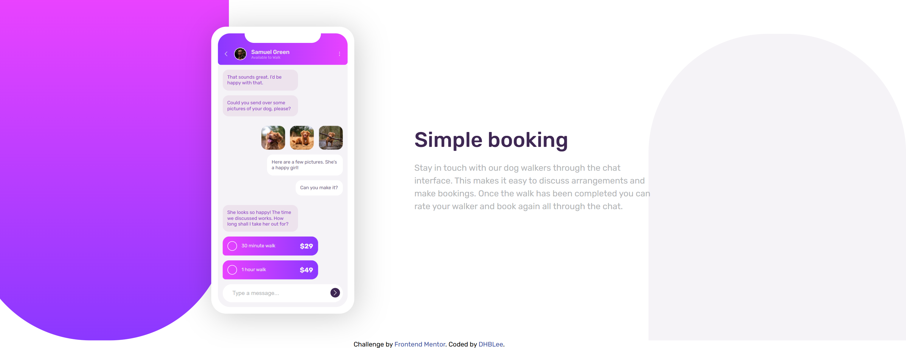
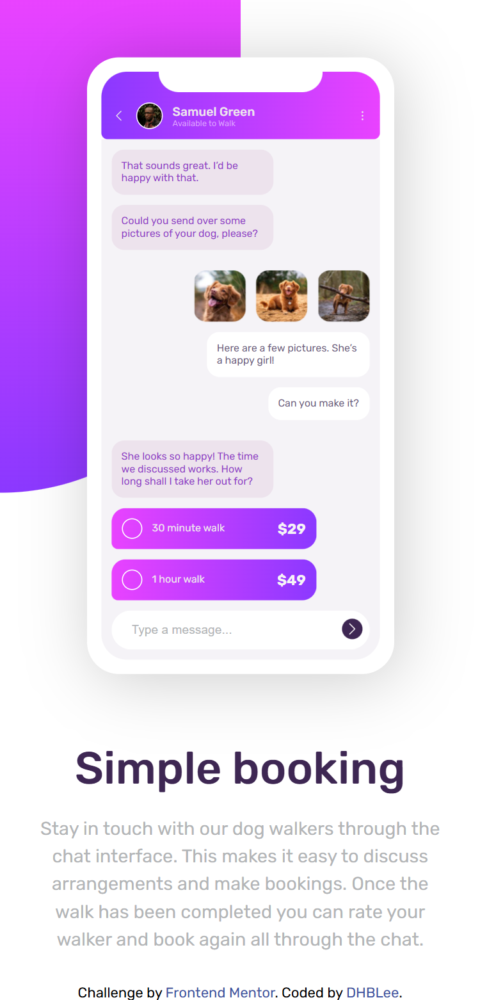

# Frontend Mentor - Chat app CSS illustration solution

This is a solution to the [Chat app CSS illustration challenge on Frontend Mentor](https://www.frontendmentor.io/challenges/chat-app-css-illustration-O5auMkFqY). Frontend Mentor challenges help you improve your coding skills by building realistic projects. 

## Table of contents

- [Overview](#overview)
  - [The challenge](#the-challenge)
  - [Screenshot](#screenshot)
  - [Links](#links)
- [My process](#my-process)
  - [Built with](#built-with)
  - [What I learned](#what-i-learned)
  - [Continued development](#continued-development)
  - [Useful resources](#useful-resources)
- [Author](#author)

## Overview

A website that focuses on styling and few animations. 

### The challenge
I guess it was still challenging but still managable. As long as you can imagine how your CSS stylie will look like based on your HTML strucutre, then you're good to go ig.

Users should be able to:

- View the optimal layout for the site depending on their device's screen size
- See hover states for all interactive elements on the page

### Screenshot

### Links

- Solution URL: [Add solution URL here](https://github.com/DHBLee/DHBLee2/tree/DHBLee/Fronend-Mentor/Chat)
- Live Site URL: [Add live site URL here](https://dhb-lee2-392f.vercel.app/)

## My process

I started with the HTML strucutre, then next was CSS

### Built with

- Semantic HTML5 markup
- CSS custom properties
- Flexbox
- Mobile-first workflow

### What I learned

I learned more about CSS

### Continued development

More efficeint, scalable codes in the future

### Useful resources

- [Example resource 1](https://www.chatgpt.com) - Kinda..

## Author

[@DHBLee](https://www.frontendmentor.io/profile/DHBLee)

