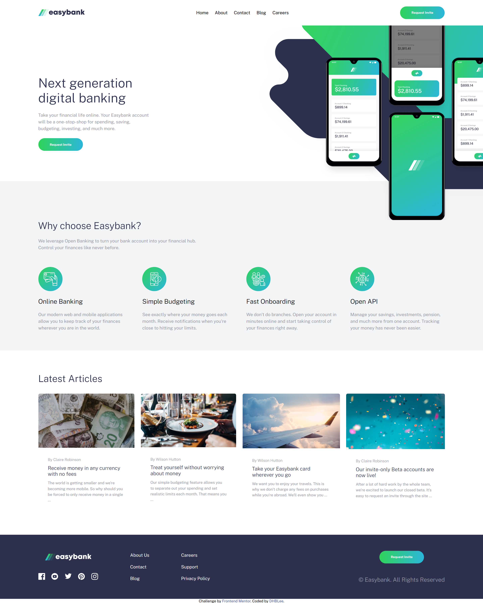
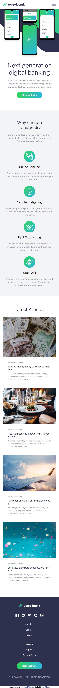

# Frontend Mentor - Easybank landing page solution

This is a solution to the [Easybank landing page challenge on Frontend Mentor](https://www.frontendmentor.io/challenges/easybank-landing-page-WaUhkoDN). Frontend Mentor challenges help you improve your coding skills by building realistic projects. 

## Table of contents

- [Overview](#overview)
  - [The challenge](#the-challenge)
  - [Screenshot](#screenshot)
  - [Links](#links)
- [My process](#my-process)
  - [Built with](#built-with)
  - [What I learned](#what-i-learned)
  - [Continued development](#continued-development)
  - [Useful resources](#useful-resources)
- [Author](#author)

## Overview

### The challenge

Users should be able to:

- View the optimal layout for the site depending on their device's screen size
- See hover states for all interactive elements on the page

### Screenshot

### Links

- Solution URL: [Add solution URL here](https://github.com/DHBLee/DHBLee2/tree/DHBLee/Fronend-Mentor/Easybank)
- Live Site URL: [Add live site URL here](https://dhb-lee2-kfm1.vercel.app/)

## My process

I focused on building the HTML strucutre first with a goal of making my CSS style easier to do.

### Built with

- Semantic HTML5 markup
- CSS custom properties
- Flexbox
- Mobile-first workflow

### What I learned

I learned how to position an image that overlaps with some sides and not overlap in other sides by tweaking some styles.

### Continued development

TO be able to use more efficient, scalable codes in the future

### Useful resources

- [Example resource 1](https://www.chatgpt.com) - Yes!

## Author

[@DHBLee](https://www.frontendmentor.io/profile/DHBLee)