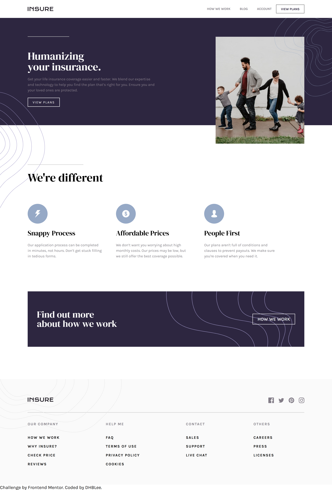
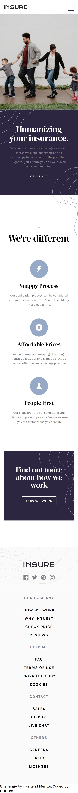

# Frontend Mentor - Insure landing page solution

This is a solution to the [Insure landing page challenge on Frontend Mentor](https://www.frontendmentor.io/challenges/insure-landing-page-uTU68JV8). Frontend Mentor challenges help you improve your coding skills by building realistic projects. 

## Table of contents

- [Overview](#overview)
  - [The challenge](#the-challenge)
  - [Screenshot](#screenshot)
  - [Links](#links)
- [My process](#my-process)
  - [Built with](#built-with)
  - [What I learned](#what-i-learned)
  - [Continued development](#continued-development)
  - [Useful resources](#useful-resources)
- [Author](#author)

## Overview

### The challenge

Users should be able to:

- View the optimal layout for the site depending on their device's screen size
- See hover states for all interactive elements on the page

### Screenshot

### Links

- Solution URL: [Add solution URL here](https://github.com/DHBLee/DHBLee2/tree/DHBLee/Fronend-Mentor/Insure)
- Live Site URL: [Add live site URL here](https://dhb-lee2-yket.vercel.app/)

## My process

### Built with

- Semantic HTML5 markup
- CSS custom properties
- Flexbox
- CSS Grid
- Mobile-first workflow
- JS

### What I learned

I learned more how to use position absolute, and some tips and tricks when it comes to widths, margins, and paddings

### Continued development

will definitely learn more how to code efficiently, and amke it scalable so that in the future, when things escalate, my code will still be easy to understand and to debug.

### Useful resources

- [Example resource 1](https://www.chatgpt.com) - Of course!

## Author

[@DHBLee](https://www.frontendmentor.io/profile/DHBLee)

