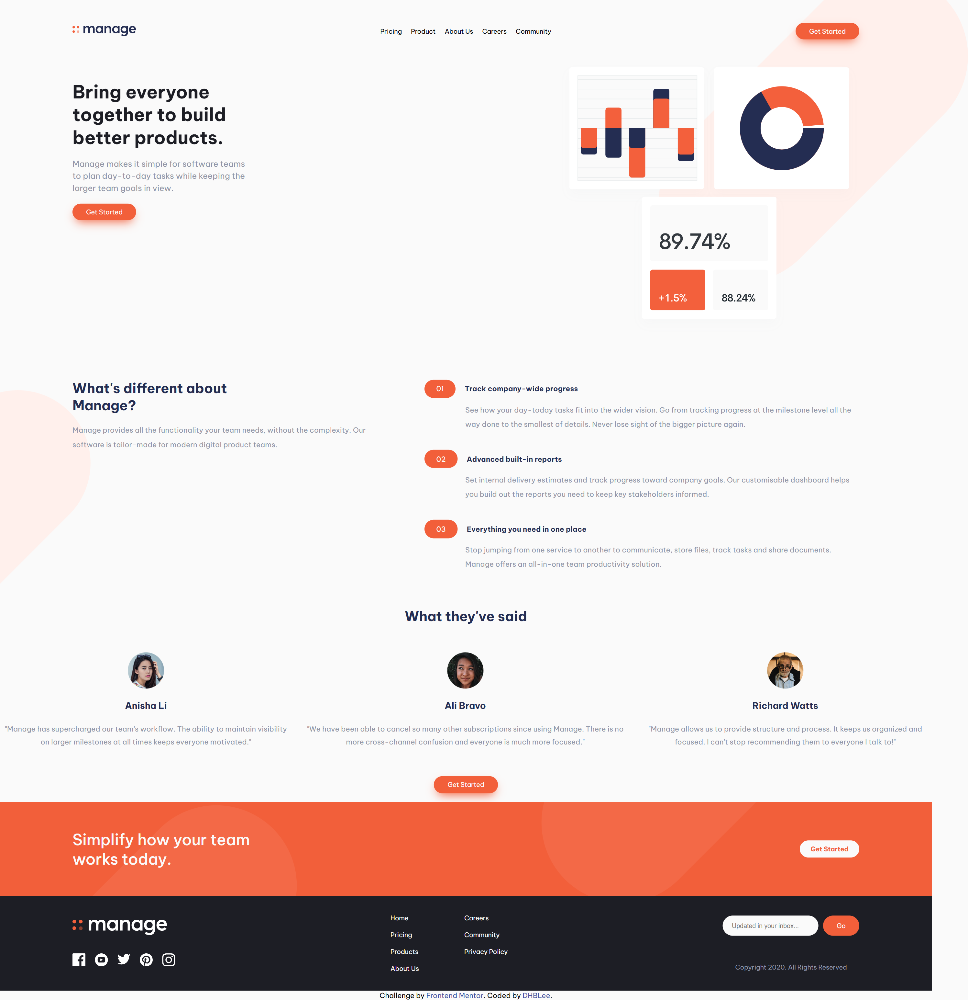

# Frontend Mentor - Manage landing page solution

This is a solution to the [Manage landing page challenge on Frontend Mentor](https://www.frontendmentor.io/challenges/manage-landing-page-SLXqC6P5). Frontend Mentor challenges help you improve your coding skills by building realistic projects. 

## Table of contents

- [Overview](#overview)
  - [The challenge](#the-challenge)
  - [Screenshot](#screenshot)
  - [Links](#links)
- [My process](#my-process)
  - [Built with](#built-with)
  - [What I learned](#what-i-learned)
  - [Continued development](#continued-development)
  - [Useful resources](#useful-resources)
- [Author](#author)

## Overview

### The challenge

Users should be able to:

- View the optimal layout for the site depending on their device's screen size
- See hover states for all interactive elements on the page

### Screenshot

### Links

- Solution URL: [Add solution URL here](https://github.com/DHBLee/DHBLee2/tree/DHBLee/Fronend-Mentor/Manage)
- Live Site URL: [Add live site URL here](https://dhb-lee2-fxf5.vercel.app/)

## My process

### Built with

- Semantic HTML5 markup
- CSS custom properties
- Flexbox
- SCSS
- Mobile-first workflow
- JS

### What I learned

My first team implementing SCSS on my fronend mentor challenge. I learned how to use SCSS hoping that my CSS will be more organized and efficient. So far, SCSS helped me to organize my code, and to use efficient and convenient styling by using the BEM and nesting features. 

### Continued development

I still haven't learned all the features that SCSS can offer, so I'll continue learning that one. As well as learning more JS/HTML codes and how to make it efficient and scalable.

### Useful resources

- [Example resource 1](https://www.chatgpt.com) - Yesser

## Author

[@DHBLee](https://www.frontendmentor.io/profile/DHBLee)
