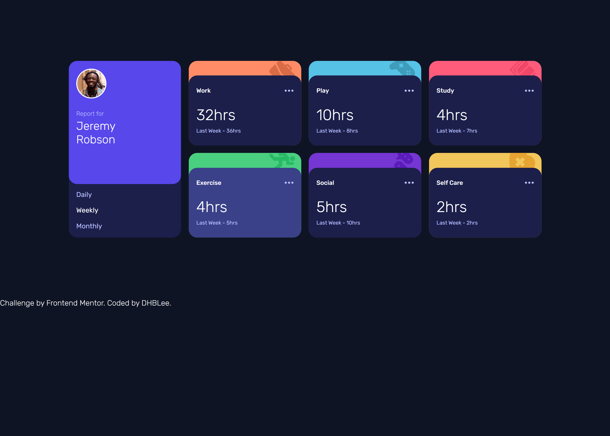
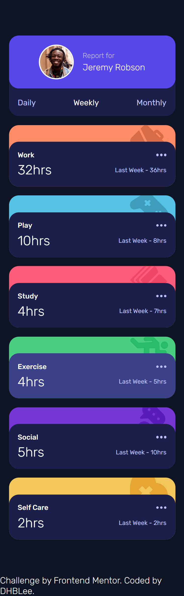

# Frontend Mentor - Time tracking dashboard solution

This is a solution to the [Time tracking dashboard challenge on Frontend Mentor](https://www.frontendmentor.io/challenges/time-tracking-dashboard-UIQ7167Jw). Frontend Mentor challenges help you improve your coding skills by building realistic projects. 

## Table of contents

- [Overview](#overview)
  - [The challenge](#the-challenge)
  - [Screenshot](#screenshot)
  - [Links](#links)
- [My process](#my-process)
  - [Built with](#built-with)
  - [What I learned](#what-i-learned)
  - [Continued development](#continued-development)
  - [Useful resources](#useful-resources)
- [Author](#author)

## Overview

### The challenge

Users should be able to:

- View the optimal layout for the site depending on their device's screen size
- See hover states for all interactive elements on the page
- Switch between viewing Daily, Weekly, and Monthly stats

### Screenshot

### Links

- Solution URL: [Add solution URL here](https://github.com/DHBLee/DHBLee2/tree/DHBLee/Fronend-Mentor/Time)
- Live Site URL: [Add live site URL here](https://dhb-lee2-zuph.vercel.app/)

## My process

### Built with

- Semantic HTML5 markup
- CSS custom properties
- Flexbox
- CSS Grid
- Mobile-first workflow
- JS

### What I learned

I learned how to use a json file and effectively use it for my JS. There was also a json file in a project I did and I didn't use it, so comparing it now, my lines of codes is now shorter and easier to understand!

### Continued development

But still, I believe there are still more efficient and scalable codes for this project so I'll still continue to study and learn HTML, CSS, and JS.

### Useful resources

- [Example resource 1](https://www.chatgpt.com) - Like, yeah.

## Author

- Frontend Mentor - [@DHBLee](https://www.frontendmentor.io/profile/DHBLee)

