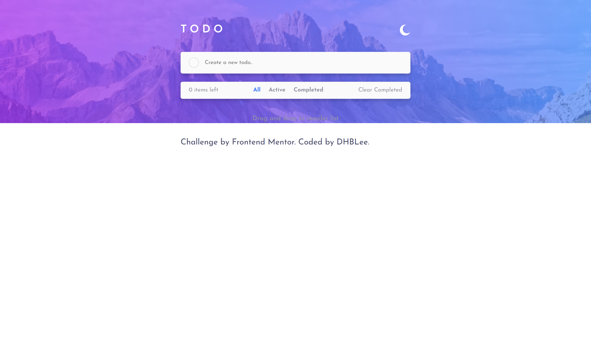
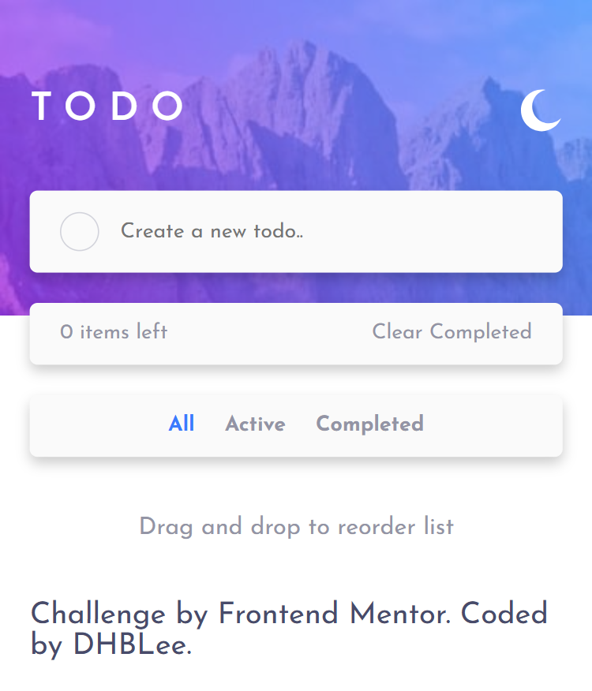

# Frontend Mentor - Todo app solution

This is a solution to the [Todo app challenge on Frontend Mentor](https://www.frontendmentor.io/challenges/todo-app-Su1_KokOW). Frontend Mentor challenges help you improve your coding skills by building realistic projects. 

## Table of contents

- [Overview](#overview)
  - [The challenge](#the-challenge)
  - [Screenshot](#screenshot)
  - [Links](#links)
- [My process](#my-process)
  - [Built with](#built-with)
  - [What I learned](#what-i-learned)
  - [Continued development](#continued-development)
  - [Useful resources](#useful-resources)
- [Author](#author)

## Overview

### The challenge

Users should be able to:

- View the optimal layout for the site depending on their device's screen size
- See hover states for all interactive elements on the page

### Screenshot

### Links

- Solution URL: [Add solution URL here](https://github.com/DHBLee/DHBLee2/tree/main/todo-app-main)
- Live Site URL: [Add live site URL here](https://dhb-lee2-rtdh.vercel.app/#)

## My process

I first started planning my html so that I can easily apply css and make bunch of things cohesive as much as possilble. Then I added the JS after implmeenting CSS and HTML. I had to swith up some CSS to cope up with the JS code I made but things worked out in the end/

### Built with

- Semantic HTML5 markup
- CSS custom properties
- Flexbox
- Mobile-first workflow
- JS

### What I learned

I learned a lot of JS code here. HTML and CSS was fine and is not hard,  but JS is hard as heck! I learned more on forEach loop, addevent listener, and some new syntaxes. 

### Continued development

Definetely making my code more effcient and scalable. My codes right now are for the sake of making things work.

### Useful resources

- [Example resource 1](https://www.chatgpt.com) - Of course!

## Author

[@DHBlee](https://www.frontendmentor.io/profile/DHBLee)

